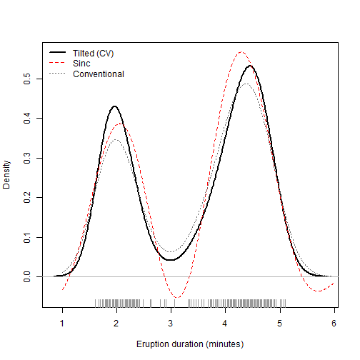
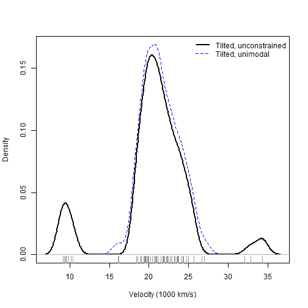

This script reproduces every numerical result, table and figure in the
manuscript. It needs the `tiltdens` package (CRAN, or
`remotes::install_github("DoostiH/tiltdens")`) and `MASS`, which ships with R.

Run time is about fifteen minutes on a laptop, almost all of it in the
simulation of Section 5.1. Every random draw is seeded, so the numbers
below should match the manuscript exactly on any platform with the same R
version; small differences in the last digit across platforms are possible
in the optimised-boundary fits, where near-ties between candidate
boundaries are broken by floating-point comparisons.


``` r
library("tiltdens")
options(width = 76)
set.seed(2016)
```

## Section 4: Using the package


``` r
x <- c(rnorm(50, -1.5), rnorm(50, 1.5))

fit <- tilt_density_cv(x)
fit
```

```
## 
## Tilted density estimate, cross-validated (Doosti, Hall & Mateu 2018)
## 
## Call:      tilt_density_cv(x = x)
## Data:      x (100 obs.)
## Bandwidth: 0.62462  (gaussian kernel)
## Blocks:    3
## Breaks:    at ranks 33, 67  (x = -1.32,  1.10), chosen by "equal"
## CV:        -0.14876
## Minimum:   7.8671e-05  (a proper density cannot go below zero)
```

``` r
summary(fit)
```

```
## 
## Method:           tilt_density_cv
## Observations:     100
## Kernel:           gaussian, bandwidth 0.62462
## Distinct weights: 3 of 3 allowed
## Weight range:     0.0082619 to 0.0110686  (largest / smallest positive = 1.34)
## Block boundaries: -1.3203,  1.1041
## Criterion:        cv = -0.14876
## Minimum density:  7.87e-05
```

The comparator goes negative; the tilted estimate cannot.


``` r
c(sinc = min(sinc_density(x)$y), tilted = min(fit$y))
```

```
##          sinc        tilted 
## -1.425296e-02  7.867101e-05
```

Block boundaries: fixed, at the troughs of a pilot estimate, or optimised.


``` r
sapply(c("equal", "modal", "optimal"), function(b)
  tilt_density(x, m = 3, breaks = b)$distance2)
```

```
##       equal       modal     optimal 
## 0.001974659 0.002116792 0.001629076
```

Kernels and canonical bandwidths.


``` r
tilt_kernels()
```

```
## [1] "gaussian"     "laplace"      "laplace2"     "laplace3"    
## [5] "laplace4"     "epanechnikov" "biweight"     "triweight"   
## [9] "triangular"
```

``` r
round(sapply(c("gaussian", "epanechnikov", "biweight"), bw_canonical_factor), 4)
```

```
##     gaussian epanechnikov     biweight 
##       0.7764       1.7188       2.0362
```

Shape constraints and multivariate data (shown but not printed in the paper).


``` r
tilt_density(x, m = Inf, constraint = "unimodal")
```

```
## 
## Tilted density estimate (Doosti & Hall 2016)
## 
## Call:      tilt_density(x = x, m = Inf, constraint = "unimodal")
## Data:      x (100 obs.)
## Bandwidth: 0.4878  (gaussian kernel)
## Comparator: sinc with bandwidth 0.4878 
## Blocks:    100 (one per observation)
## Distance:  0.0041306 (squared L2 to the comparator)
## Minimum:   6.7226e-10  (a proper density cannot go below zero)
```

``` r
X <- cbind(x, c(rnorm(50, -1), rnorm(50, 1)))
tilt_density(X)
```

```
## 
## Tilted density estimate (Doosti & Hall 2016, Section 3.3)
## 
## Call:      tilt_density(x = X)
## Data:      X (100 obs., 2 dimensions)
## Bandwidth: 0.7142 (product kernel)
## Comparator: sinc with bandwidth 0.7142 
## Distance:  0.0012356 (squared L2 to the comparator)
## 
## Use predict() to evaluate, or plot() for a two-dimensional contour.
```

## Section 5.1: Simulation (Table 1)

Four Marron and Wand (1992) densities, n = 100, 40 replicates. Samples for
each density are drawn up front from a fixed seed, so partial re-runs give
identical results.


``` r
mw <- list(
  Gau = list(w = 1,           mu = 0,            sd = 1),
  KtU = list(w = c(2, 1) / 3, mu = c(0, 0),      sd = c(1, 1 / 10)),
  SeB = list(w = c(1, 1) / 2, mu = c(-3/2, 3/2), sd = c(1/2, 1/2)),
  SkB = list(w = c(3, 1) / 4, mu = c(0, 3/2),    sd = c(1, 1/3))
)
mw_pdf <- function(d) function(t)
  Reduce(`+`, Map(function(w, m, s) w * dnorm(t, m, s), d$w, d$mu, d$sd))
mw_rnd <- function(d, n) {
  k <- sample(length(d$w), n, TRUE, d$w)
  rnorm(n, d$mu[k], d$sd[k])
}
ise_grid <- function(y, grid, truth) {
  d <- (y - truth(grid))^2
  sum(diff(grid) * (d[-1] + d[-length(d)]) / 2)
}

## The seeds below are those used in the manuscript: 20160209 plus the position
## of the density in the full list of eight Marron-Wand densities.
seed_of <- c(Gau = 1, KtU = 4, SeB = 7, SkB = 8) + 20160209

n_rep <- 40; n <- 100
methods <- c("conventional", "sinc", "trapezoid", "tilt_n", "tilt_3", "tilt_cv")
mise <- matrix(NA_real_, length(mw), length(methods), dimnames = list(names(mw), methods))

for (nm in names(mw)) {
  d <- mw[[nm]]; truth <- mw_pdf(d)
  grid <- seq(min(min(d$mu - 4 * d$sd), -4), max(max(d$mu + 4 * d$sd), 4), length.out = 512)
  a <- grid[1]; b <- grid[512]
  set.seed(seed_of[[nm]])
  xs <- replicate(n_rep, mw_rnd(d, n))
  out <- matrix(NA_real_, n_rep, length(methods), dimnames = list(NULL, methods))
  for (r in seq_len(n_rep)) {
    xr <- xs[, r]; hc <- as.numeric(bw_comparator_cv(xr))
    out[r, "conventional"] <- ise_grid(density(xr, bw = bw_nrd_robust(xr), from = a, to = b, n = 512)$y, grid, truth)
    out[r, "sinc"]         <- ise_grid(sinc_density(xr, bw = hc, n = 512, from = a, to = b)$y, grid, truth)
    out[r, "trapezoid"]    <- ise_grid(trapezoid_density(xr, bw = hc, n = 512, from = a, to = b)$y, grid, truth)
    out[r, "tilt_n"]       <- ise_grid(tilt_density(xr, m = Inf, comparator_bw = hc, n = 512, from = a, to = b)$y, grid, truth)
    out[r, "tilt_3"]       <- ise_grid(tilt_density(xr, m = 3,   comparator_bw = hc, n = 512, from = a, to = b)$y, grid, truth)
    out[r, "tilt_cv"]      <- ise_grid(tilt_density_cv(xr, n = 512, from = a, to = b)$y, grid, truth)
  }
  mise[nm, ] <- colMeans(out)
}
```

Table 1, MISE x 1000:


``` r
round(mise * 1000, 2)
```

```
##     conventional  sinc trapezoid tilt_n tilt_3 tilt_cv
## Gau         5.81  6.14      6.89   5.73   5.77    6.76
## KtU       104.92 75.82     60.77  74.09  59.03   68.63
## SeB        43.67 15.22     16.66  13.48  14.31   27.20
## SkB        11.38 16.61     13.09  15.63  13.22   12.22
```

## Section 5.2: Old Faithful (Figure 1)


``` r
x <- faithful$eruptions
fit_cv   <- tilt_density_cv(x)
fit_sinc <- sinc_density(x, bw = fit_cv$bw, from = 1, to = 6)
c(sinc = min(fit_sinc$y), tilted = min(fit_cv$y))
```

```
##         sinc       tilted 
## -0.053137201  0.000220287
```

``` r
conv <- density(x, bw = bw_nrd_robust(x), from = 1, to = 6)
plot(fit_cv$x, fit_cv$y, type = "l", lwd = 2, xlab = "Eruption duration (minutes)",
     ylab = "Density", ylim = range(0, fit_sinc$y, fit_cv$y, conv$y))
lines(fit_sinc, col = "red", lty = 2)
lines(conv, col = "grey40", lty = 3)
abline(h = 0, col = "grey70"); rug(x, col = "grey60")
legend("topleft", c("Tilted (CV)", "Sinc", "Conventional"),
       col = c("black", "red", "grey40"), lty = 1:3, lwd = c(2, 1, 1), bty = "n")
```



## Section 5.3: Galaxy velocities (Figure 2)


``` r
g <- MASS::galaxies / 1000
free     <- tilt_density(g, m = Inf)
unimodal <- tilt_density(g, m = Inf, constraint = "unimodal")
c(free = free$distance2, unimodal = unimodal$distance2)
```

```
##        free    unimodal 
## 0.001068358 0.005765238
```

``` r
unimodal$distance2 / free$distance2
```

```
## [1] 5.396356
```

``` r
plot(free$x, free$y, type = "l", lwd = 2, xlab = "Velocity (1000 km/s)",
     ylab = "Density", ylim = range(0, free$y, unimodal$y))
lines(unimodal$x, unimodal$y, col = "blue", lty = 2, lwd = 1.5)
abline(h = 0, col = "grey70"); rug(g, col = "grey60")
legend("topright", c("Tilted, unconstrained", "Tilted, unimodal"),
       col = c("black", "blue"), lty = 1:2, lwd = c(2, 1.5), bty = "n")
```



## Session information


``` r
sessionInfo()
```

```
## R version 4.3.3 (2024-02-29 ucrt)
## Platform: x86_64-w64-mingw32/x64 (64-bit)
## Running under: Windows 11 x64 (build 26200)
## 
## Matrix products: default
## 
## 
## locale:
## [1] LC_COLLATE=English_Australia.utf8  LC_CTYPE=English_Australia.utf8   
## [3] LC_MONETARY=English_Australia.utf8 LC_NUMERIC=C                      
## [5] LC_TIME=English_Australia.utf8    
## 
## time zone: Australia/Sydney
## tzcode source: internal
## 
## attached base packages:
## [1] stats     graphics  grDevices utils     datasets  methods   base     
## 
## other attached packages:
## [1] tiltdens_0.1.1
## 
## loaded via a namespace (and not attached):
##  [1] MASS_7.3-60.0.1   compiler_4.3.3    cli_3.6.6         tools_4.3.3      
##  [5] rstudioapi_0.16.0 yaml_2.3.10       knitr_1.52        xfun_0.54        
##  [9] rlang_1.3.0       evaluate_1.0.5    quadprog_1.5-8
```

